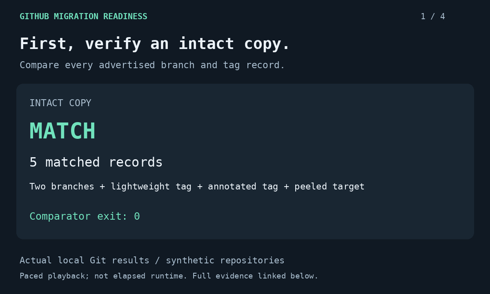

# GitHub migration readiness

An offline Python assessment tool with an optional read-only Azure DevOps Cloud collector for source-control migration planning. It highlights missing ownership, ref mismatches, identity gaps, and dependencies that need deliberate cutover work.

**Scope:** normalized inventory assessment, offline comparison of captured Git branch/tag refs, and optional collection of visible repository/default-branch/branch metadata from one Azure DevOps project. Examples use synthetic data; the ref rehearsal runs real Git against disposable local repositories. Nothing in this repository migrates existing repositories.

## Verify branches and tags

### Watch the 30-second evidence walkthrough

[Static summary](docs/assets/ref-demo/summary.png) · [Text version and full results](docs/assets/ref-demo/transcript.md) · [Recreate the visual](docs/ref-demo.md)



This presentation uses a fresh local rehearsal's actual counts and object IDs. Its four frames play once over 30 seconds; the pacing does not represent execution time. Captures and generated reports are retained alongside the visual.

Run a [local Git rehearsal](docs/ref-verification.md) that verifies an intact copy, then detects missing, unexpected and changed refs in a deliberately altered copy:

```shell
python rehearse_refs.py --output-dir reports/ref-rehearsal
```

Requires Git and Python 3.11+. No credentials or network access are needed. The rehearsal checks annotated-tag objects separately from their peeled targets, preserves both captures and generates JSON/Markdown evidence. See the [synthetic difference report](examples/ref-verification/refs.md). Matching refs is one migration acceptance check; default branch, LFS, permissions and platform metadata require separate verification.

## Collect, assess, report

The [Azure DevOps collector walkthrough](docs/azure-devops-collector.md) covers authenticated read-only discovery, pagination, bounded retries, permission errors and explicit unknowns. Try the complete flow without credentials:

```shell
# From the repository root, replay synthetic HTTP responses into a NEW directory.
# Fixture mode performs no network requests and does not read credentials.
python collect_azure_devops.py --fixture examples/azure-devops/responses.json --output-dir reports/azure-devops-demo

# Generate a report from the collector's normalized output. The fictional
# default-branch mismatch is expected, so this demonstration permits findings.
python readiness.py reports/azure-devops-demo/inventory.json --output-dir reports/azure-devops-demo --fail-on never
```

Expected: 2 repositories collected; **1 blocker and 1 unknown** in the assessment. Inspect the [generated report](examples/azure-devops/readiness.md). Choose a different output directory for another collection; existing directories are refused. The live mode has not been exercised against a real organization. Owner, archive intent, LFS, hooks, pipeline dependencies and identity mappings remain unknown until separately verified.

## Walk through a complete sample assessment

Start with the [six-repository scenario](docs/sample-assessment.md), inspect its [generated report](examples/migration-assessment/readiness.md), and follow the [migration runbook](docs/migration-runbook.md) from discovery through recovery. The scenario connects every repository's findings to accountable roles, next actions and acceptance evidence, including security requirements the CLI cannot inspect.

Requires Git and Python 3.11 or later. CI runs Python 3.12 on Ubuntu with Bash and Windows with PowerShell, exercising the full test suite, real local Git rehearsal and synthetic collect/assess/report commands on each platform. No third-party packages or credentials are needed. Run these commands from a fresh checkout:

```shell
# Clone the public assessment tool and enter the repository root.
git clone https://github.com/baileynyx/github-migration-readiness.git
cd github-migration-readiness

# Generate both report formats from fictional evidence. Findings are expected,
# so this demonstration allows report generation to finish with exit code 0.
python readiness.py examples/migration-assessment/inventory.json --output-dir reports/migration-assessment --fail-on never

# Exercise the assessment contract, committed report reproduction and CLI gates.
python -m unittest discover -s tests -v
```

Expected CLI output:

```json
{"blocker": 1, "ready": 1, "review": 3, "unknown": 1}
```

Open `reports/migration-assessment/readiness.md` for findings and resolutions, or `readiness.json` in the same directory for structured results. The suite currently contains 50 tests. Its malformed-input test deliberately prints an assessment error while checking exit code 2; the final test result should be `OK`.

Each CI job publishes its own captures and reports as `synthetic-readiness-report-ubuntu-latest` or `synthetic-readiness-report-windows-latest`, retained for 7 days. The Windows job also checks the documented `$LASTEXITCODE` behavior for an expected ref difference. See the [workflow runs](https://github.com/baileynyx/github-migration-readiness/actions/workflows/ci.yml) for results at a specific commit.

To demonstrate the stricter inventory gate:

```shell
# This sample must return exit code 1 because it contains unresolved findings.
# Report files are still generated before the CLI reports an unready inventory.
python readiness.py examples/migration-assessment/inventory.json --output-dir reports/migration-assessment --fail-on unready
```

Inspect `$LASTEXITCODE` in PowerShell or `$?` in Bash immediately after the command. An exit code of 1 is the intended gate result; 2 means an input/output error. `--fail-on never` still returns 2 on an error and does not certify readiness.

Some true facts, such as LFS usage, keep a repository in `review` even after operational checks are signed off. Retain those facts and record human acceptance separately; do not erase evidence to pass the gate. See the [scenario's gate interpretation](docs/sample-assessment.md#interpret-the-gate-honestly).

## Try it in two minutes

Requires Python 3.11 or later; no packages, credentials, or cloud resources.

```shell
python readiness.py examples/inventory.json --output-dir reports --fail-on never
python -m unittest discover -s tests -v
```

Read `reports/readiness.md` or the committed [sample report](examples/readiness.md). The sample has one blocker, one unknown repository, and one repository with no findings.

For a conservative CI inventory gate, use `--fail-on unready`: exit 0 means all inventories have no findings, 1 means findings need attention, and 2 means input or output failed. `--fail-on blocker` is the default and permits review/unknown outcomes. Neither mode substitutes for documented operational acceptance before cutover.

## Input contract

The root contains integer `schema_version: 1` and a nonempty `repositories` array. Repository names must be unique, ignoring case. Unsupported repository fields fail validation so typos cannot silently change an assessment.

| Field | Type | Meaning |
| --- | --- | --- |
| name | Nonempty string, required | Stable repository identifier |
| owner | String | Accountable target owner; empty blocks |
| default_branch | String | Intended default branch; empty blocks |
| branches | String list | Observed branch names; absent default ref blocks |
| archived | Boolean | True requires scope review |
| uses_lfs | Boolean | True requires separate object transfer verification |
| hooks | String list | Hooks to recreate and test |
| pipeline_dependencies | String list | Agents, feeds, service connections or dependent jobs |
| unmapped_identities | String list | Unresolved identities; nonempty blocks |

Except for `name`, missing/null values are unknown, never a pass. Explicit empty lists mean observed absence. Each repository takes the highest finding category: blocker, unknown, review, then ready. A ready result covers only this inventory contract, not every migration risk.

## Why this design

Normalization separates provider collection from assessment. Deterministic inventory/report content is easy to diff in review; collection timestamps are recorded separately. Assessment and synthetic replay require no network client or credentials. Field-level resolutions explain the next action rather than reduce a migration to a misleading percentage score.

## Rehearsal and cutover

The [full runbook](docs/migration-runbook.md) assigns responsibilities and evidence gates to these stages, including recovery after new destination writes exist.

1. Confirm scope, owner, destination, and the meaning of every unknown field.
2. Capture source refs and LFS inventory. Rehearse import into an isolated destination.
3. Compare `git ls-remote --heads --tags` output, including annotated-tag object and peeled refs. Check LFS objects from a fresh clone.
4. Validate issues, identities, permissions, branch rules, hooks, pipelines, agents and feeds independently; matching Git refs does not prove those moved.
5. Agree a write freeze and fallback criteria. Reconcile final refs, run pipeline smoke tests, then change source-of-truth links.
6. Keep the source read-only during the agreed observation window. If fallback is needed, reconcile post-cutover writes before reopening it; do not create two writable sources of truth.

## Evidence and limits

See [VALIDATION.md](VALIDATION.md) for executed checks. The read-only collector is implemented and tested with simulated API replies; a live organization collection remains unvalidated. There are no migrations, employer assets or invented operational metrics. Future evidence should include an authorized live rehearsal and reconciliation of visible repository scope before expanding collection to additional fields.
